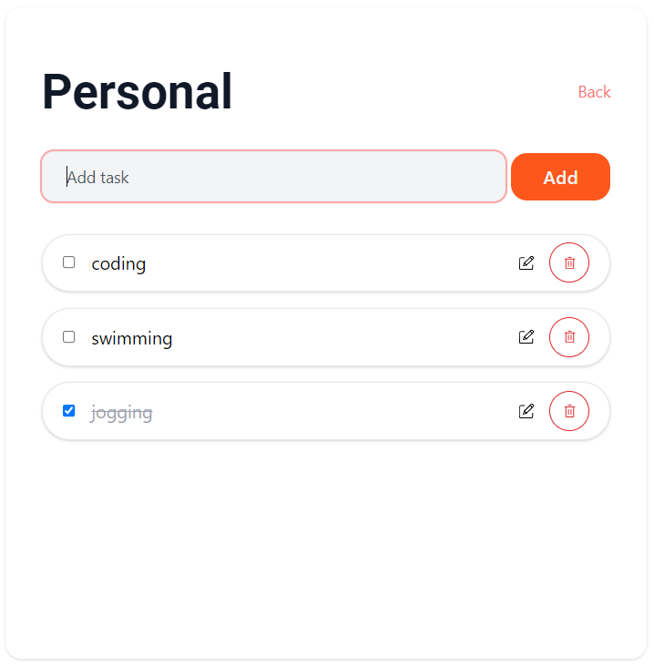

# ToDo-List

ToDo list is a simple Web application to save your daily task. I am using a server-client architecture and this is the client side written in React.

## Installation

```
yarn
```

## Execute

```
yarn start
```

## Features

- Multiple todo list
- Add new task
- Edit task
- Mark task as completed or uncompleted
- Delete task

## Technologies used:

- HTML
- CSS
- React
- [Ruby on Rails](https://github.com/Jcheahh/todo-backend)

## Dependencies

- `react-final-form`
- `react-router-dom`
- `axios`

## Styling

- `tailwind`

## Screenshot



